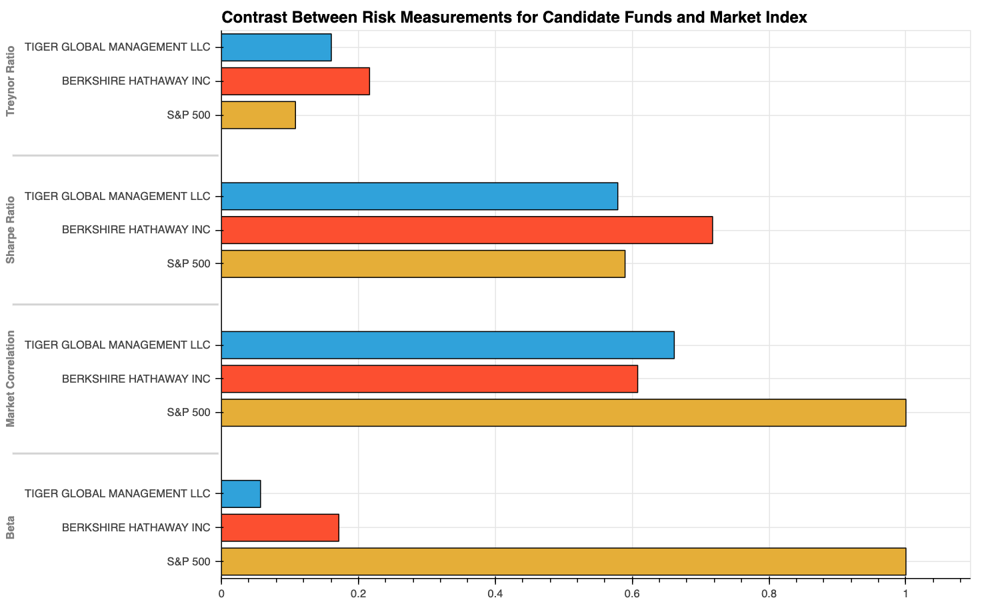
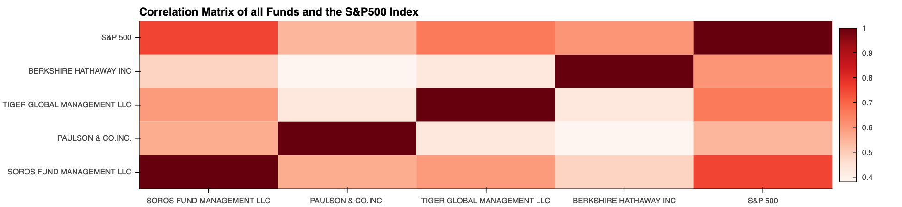

# Risk_Return_Analysis

Quantitative analysis for a FinTech investing platform. This platform aims to offer clients a one-stop online investment solution for their retirement portfolios that’s both inexpensive and high quality (similar provider as [Wealthfront](https://www.wealthfront.com/) or [Betterment](https://www.betterment.com/)). To keep the costs low, the firm uses algorithms to build each client's portfolio. The algorithms choose from various investment styles and options.

This analysis evaluates four new investment options for inclusion in the client portfolios. The analysis determines the fund with the most investment potential based on key risk-management metrics: daily returns, standard deviations, correlations, Sharpe ratios, betas, and Treynor ratios.

## Technologies

Libraries that need to be imported are:
`Pandas`, `NumPy`, `Pathlib`, `Csv`, `Matplotlib`, and `hvPlot`.

Some parts use `Python 3.7` or higer, due to the use of f-strings.

## Instalation Guide
The file is a jupyter notebook. If you don't have jupyter lab, you can install it following the instruction here:

https://jupyterlab.readthedocs.io/en/stable/getting_started/installation.html

### Usage

This is a jupyter notebook with a pre-run code. You can go through it and see code as well as results. 

If you look to reuse the code, and do not have experience on jupyter lab, please refer:
https://www.dataquest.io/blog/jupyter-notebook-tutorial/

#### Some samples visualizations included in the analysis:

> **A summary of risk metrics on final candidates:**

> **A powerful visualization for correlations among funds and the market index:**

> **Different types of plots assessing performance and risk, useful for the analysis:**

#### Conclusions are clearly stated

" I recommend to include Berkshire Hathaway Inc for the following reasons:

>    1) Both candidate funds have a good response in times of market crushes, and this set an advantage to **Berkshire**, since that funds is more volatile[..]

>    2) **Berkshire** has a better performance adjusted by risk as can be seen in a higher Sharpe ratio  [..]

>    3) **Berkshire** has a better performance adjusted by Beta than Tiger [..]

>    4) The correlation of **Bershire** with the market is 0.60, which is less than the correlation of **Tiger** with the market of 0.66 [..]

>    5) The selection should be of high investment potential, and suitable for retirement portfolios. [..] We can confirm this considering the low rolling 60 day beta [..]

In conclusion, **Berkshire Hathaway Inc** is the best option to be included in the firm's suite of fund offering for retirement funds, because it has low risk, a good response to market drops, the best measurements of performance adjusted by risk, and offer the best diversification benefits given the lower correlation with the equity market."

## Contributors
This project was coded by Paola Carvajal Almeida, paola.antonieta@gmail.com.

Contact email: paola.antonieta@gmail.com
LinkedIn profile: https://www.linkedin.com/in/paolacarvajal/

## License
This project uses a MIT license. This license allows you to use the licensed material at your discretion, as long as the original copyright and license are included in your work files. This license does not contain a patent grant,  and liberate the authors of any liability from the use of this code.
