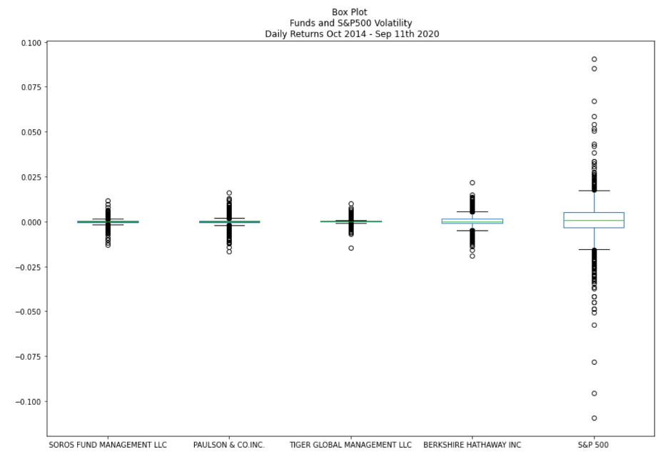

# Risk_Return_Analysis

Analysis for fund inclusion in a portfolio

In this analysis, several investment performance and risk measurements are used to analyze four funds and deciding for the inclusion to a suite of portfolios of high quality.

Measurements used are: returns, volatility, standard deviation, correlation, beta, Sharpe ratio, and Treynor ratio.

Several plots of cummulative returns, rolling variance, rolling betas, and similar are presented.

## Technologies

Libraries that need to be imported are:
pandas, numpy, pathlib, csv, and matplotlib

Some parts use Python 3.0 or higer, due to the use of f-strings.

## Instalation Guide
The file is a jupyter notebook. If you don't have jupyter lab, you can install it following the instruction here:

https://jupyterlab.readthedocs.io/en/stable/getting_started/installation.html

### Usage

This is a jupyter notebook with a pre-run code. You can go through it and see code as well as results. 

If you look to reuse the code, and do not have experience on jupyter lab, please refer:
https://www.dataquest.io/blog/jupyter-notebook-tutorial/

#### Some samples visualizations included in the analysis:

#### Conclusions are clearly stated

" I recommend to include Berkshire Hathaway Inc for the following reasons:

>    1) Both funds have a good response in times of market crushess. For example, [..]

>    2) Berkshire has more volatility, but much better performance. The Sharpe ratio [..]

>    3) Both investments has low beta, so both are low risk. Moreover, the Treynor Ratios [..]

>    4) The correlation of Bershire with the market is 0.60, which is less than the correlation of Tiger with the market of 0.66 [..]

>    5) The selection should be of high investment potential, and suitable for retirement portfolios. [..] We can confirm this considering the low rolling 60 day beta [..]

In conclusion, Berkshire Hathaway Inc is the best option to be included in the firm's suite of fund offeing for retirement funds, because it has low risk, a good response to market drops, the best measurements of performance adjusted by risk, and offer the best diversification benefits given the lower correlation with the equity market."

## Contributors
This project was coded by Paola Carvajal Almeida, paola.antonieta@gmail.com.

Contact email: paola.antonieta@gmail.com
LinkedIn profile: https://www.linkedin.com/in/paolacarvajal/

## License
This project uses a MIT license. This license allows you to use the licensed material at your discretion, as long as the original copyright and license are included in your work files. This license does not contain a patent grant,  and liberate the authors of any liability from the use of this code.
